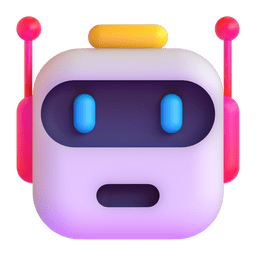

<code>console.log("Bem-vindo ao meu Github!")</code>

##  Olá, meu nome é Luan Cardoso

> Estudante de Desenvolvimento Web, fascinado por  
> tecnologia, graduando em Engenharia de Software. 
> Hoje destaco uma sólida base em Desenvolvimento  
> Web, trabalhando com NextJS e NodeJS.

[L i n k e d I n](https://www.linkedin.com/in/luanc-santos/)

####  Atualmente, consigo programar em:

####  Tecnologias que domino:

####  Estudando...

####  Github Stats 

 

 Thanks for visiting!
